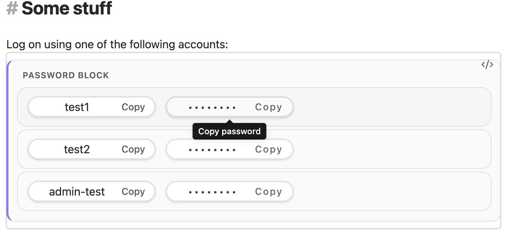

# Simple Password Plugin

Visually hide passwords and quickly copy credentials from your Obsidian notes.



## TL;DR

Add a `pw` code block, optionally give it a heading, and select a username or masked password to copy it:

````markdown
```pw Regular Users
alice:example-password
bob:another-example
```
````

View the result in **Reading view** or move the cursor outside the block in **Live Preview**. No settings or commands are needed. Currently **desktop-only**.

**This hides passwords from view—it does not encrypt them.** Your notes still contain plaintext credentials. Use a dedicated password manager for secure storage.

## General usage and features

### Credential blocks

Use one entry per line:

````markdown
```pw
# Example credentials, not real secrets
alice@example.com:example-password
username-only
:password-only
service:password:with:colons
```
````

- **Click to copy:** select either pill to copy the full value, even if its visible text is truncated. **Copied!** briefly confirms success; failures show a notice.
- **Masked passwords:** passwords always display as `••••••••`, regardless of their actual length. Usernames remain visible.
- **Optional fields:** username-only and password-only entries work. Missing fields appear as disabled placeholders.
- **Custom headings:** `pw Regular Users` displays **REGULAR USERS**. Each block can have its own heading. Plain `pw` defaults to **PASSWORD BLOCK**. Titles are plain text, not Markdown; the default also applies if Obsidian cannot supply the opening fence.
- **Keyboard support:** use Tab to reach the buttons, then Enter or Space to copy.
- **Theme-aware layout:** uses Obsidian theme colors and supports copying from pop-out windows.
- **Local operation:** no network requests, telemetry, account, or separate credential database. The plugin does not modify your notes.

### Parsing rules

| Input | Meaning |
| --- | --- |
| `alice:secret` | Username and password |
| `alice` or `alice:` | Username only |
| `:secret` | Password only |
| `alice:one:two` | Password is `one:two` |
| `# A comment` | Ignored whole line |
| `alice:secret#123` | The `#` is part of the password |

Blank lines are ignored. The first colon separates the fields; usernames cannot contain colons. Usernames are trimmed, but **every character after the first colon belongs to the password**, including spaces and tabs. Do not add padding after the colon for formatting. Whitespace-only passwords are supported; multiline passwords are not.

**Upgrading from an early development version?** Passwords used to be trimmed. An entry such as `alice: secret ` now copies both surrounding spaces. Remove unintended padding from existing blocks.

### Security and clipboard limitations

- Editing a block exposes its plaintext contents. Source files, search, backups, sync services, and other plugins may also expose them. Masking is not access control.
- Copying places the actual credential on the system clipboard. Other applications, clipboard history, and clipboard sync may retain it.
- The plugin **does not automatically clear the clipboard**. Overwrite it when finished; this may not remove clipboard history.
- If the window's clipboard API is unavailable or access is denied, copying fails with a notice. There is no hidden-textarea fallback.
- Headings and usernames are visible. Do not put secrets in a heading.

## Installation

### Manual installation

Use this method while the plugin is not yet available in the community catalog, or to test a specific release.

1. Download the individual [main.js](main.js), [manifest.json](manifest.json), and [styles.css](styles.css) assets from the desired GitHub release. If no release is available, follow the development setup below to build them.
2. Create a folder named `pw-mgr-simple` inside your vault's `.obsidian/plugins/` directory.
3. Place all three assets directly in that folder—not inside another nested directory.
4. Reload Obsidian. In **Settings → Community plugins**, enable community plugins if needed, then enable **Simple Password Plugin**.

For example, from a directory containing the three downloaded or built assets:

```sh
VAULT="/path/to/your/vault"
PLUGIN_DIR="$VAULT/.obsidian/plugins/pw-mgr-simple"
mkdir -p "$PLUGIN_DIR"
cp main.js manifest.json styles.css "$PLUGIN_DIR/"
```

Change `VAULT` to your vault's location. The folder name must match the ID in [manifest.json](manifest.json): **`pw-mgr-simple`**, not `pw-mgr`. These examples assume Obsidian's default configuration directory.

To update a manual installation, replace the same three assets and reload Obsidian. Only install plugins from sources you trust.

### Community installation, once listed

After the plugin is accepted into the catalog, select **Settings → Community plugins → Browse**, search for **Simple Password Plugin**, then select **Install** and **Enable**. This is not a claim that the plugin is already listed.

## Development setup

### 1. Install and build

Install a current **Node.js LTS** release, npm, and Git. Clone this repository using its GitHub **Code** URL, then open a terminal at the repository root.

```sh
node --version
npm --version
npm ci
npm run build
```

`npm ci` installs the exact locked dependency versions. Use `npm install` when deliberately changing dependencies or updating the lockfile.

### 2. Link the repository into a test vault

On macOS/Linux, run this **from the repository root**, replacing the placeholder path with your test vault's absolute path:

```sh
VAULT="/path/to/your/vault"
PLUGIN_DIR="$VAULT/.obsidian/plugins/pw-mgr-simple"
mkdir -p "$VAULT/.obsidian/plugins"
ln -s "$(pwd)" "$PLUGIN_DIR"
```

Replace the example vault path with your own. This makes Obsidian load the bundle and stylesheet directly from your working tree, without copying them after every edit. The link points at the whole repository, not its source directory.

**The destination must not already exist.** If you previously installed a copy, disable the plugin and move that installation elsewhere before linking. Do not run the command over an existing directory, and do not use a forced overwrite. You can inspect the link with:

```sh
ls -ld "$PLUGIN_DIR"
```

Reload Obsidian and enable **Simple Password Plugin** in **Settings → Community plugins**. Prefer a disposable local test vault with dummy credentials. A development symlink exposes the working repository to Obsidian; vault backup/sync tools may handle links differently. Do not use both the copy-install and symlink methods at the same location.

### 3. Develop and reload

```sh
npm run dev
```

Keep this terminal running. esbuild rebuilds [main.js](main.js) when TypeScript changes; stop it with Ctrl+C. Watch mode does **not** run the full type check or reload Obsidian automatically. After a rebuild, disable/re-enable the plugin or reload Obsidian to load the new code. CSS-only edits do not need a JavaScript rebuild; reload if the stylesheet does not refresh.

### Everyday commands

Run these from the repository root:

| Command | Purpose |
| --- | --- |
| `npm ci` | Install the locked dependencies |
| `npm run dev` | Build and watch TypeScript changes |
| `npm run lint` | Check source and tests with ESLint |
| `npm test` | Run credential, title, and clipboard tests |
| `npm run build` | Type-check and build the production bundle |
| `npm run lint && npm test && npm run build` | Run all automated release checks |
| `git diff --check` | Check pending changes for whitespace errors |

Stop watch mode before a release build so it cannot replace the production bundle with a development build.

### Project layout

- [src/main.ts](src/main.ts): plugin registration and unload cleanup.
- [src/parse-pw-block.ts](src/parse-pw-block.ts): credential parsing.
- [src/parse-pw-title.ts](src/parse-pw-title.ts): custom headings.
- [src/ui/pw-block.ts](src/ui/pw-block.ts): rendering, buttons, and copy feedback.
- [src/utils/clipboard.ts](src/utils/clipboard.ts): window-specific clipboard access.
- [styles.css](styles.css): block and pill styling.
- [esbuild.config.mjs](esbuild.config.mjs): development/production bundling.
- [version-bump.mjs](version-bump.mjs): release metadata updates.

Commit source, tests, documentation, and intentional dependency/lockfile changes. Do not commit generated bundles, installed dependencies, local plugin data, or real credentials. The three runtime assets belong in releases, even though the generated JavaScript is not committed.

## Maintenance and compatibility

### What needs a version bump?

| Change | Action |
| --- | --- |
| Local development or testing | Rebuild and reload; no version bump needed |
| README-only change | Usually no plugin release needed |
| Published bug fix or small styling fix | Patch release, for example `1.0.0` → `1.0.1` |
| Published backward-compatible feature | Minor release, for example `1.0.0` → `1.1.0` |
| Breaking behavior or syntax change | Major release; explain migration steps |
| New API/runtime feature that requires newer Obsidian | Raise `minAppVersion` and publish a new plugin release |
| Obsidian releases an update, but this plugin still works | Test it; no automatic version bump required |

The plugin's `version` and Obsidian's `minAppVersion` are **different things**. Keep the plugin ID stable after publication.

### Keeping up with Obsidian

Periodically, and before releasing:

1. Test on current Obsidian desktop and on the oldest version you claim to support. Recheck Live Preview, Reading view, custom headings, hover styling, and pop-out copying after editor/theme changes.
2. Review [Obsidian developer documentation](https://docs.obsidian.md), API changes, and the [plugin guidelines](https://docs.obsidian.md/Plugins/Releasing/Plugin+guidelines).
3. Check dependency updates and advisories, review the changes, then run lint, tests, and a build.
4. If you adopt an API, browser feature, or CSS feature unavailable in the old minimum version, raise `minAppVersion` in [manifest.json](manifest.json) **before** the release bump. Installing new API type definitions does not update the user's Obsidian runtime.

The manifest currently declares Obsidian **0.15.0**. Treat that as a compatibility claim to verify before publication, not proof that the current implementation works there. In particular, the hover styling uses CSS `:has()`, and clipboard behavior depends on Obsidian's bundled browser. Raise the minimum if testing shows that it is needed; do not simply set it to the newest version without a reason.

Useful maintenance commands (run on a clean working tree or a maintenance branch):

```sh
npm outdated
npm audit

# Refresh Obsidian API definitions within the declared dependency specification.
npm update obsidian

# Optionally refresh all dependencies within their declared specifications.
npm update

npm run lint && npm test && npm run build
git diff -- package.json package-lock.json
```

`npm outdated` may exit nonzero simply because updates exist. `npm update` respects pinned versions and version ranges; moving beyond them requires an intentional dependency change. Do not use `npm audit fix --force` blindly. Review advisory impact and upgrade one dependency at a time when changes are breaking. Commit reviewed dependency and lockfile updates together.

### Manual smoke test

Use dummy credentials, not real secrets:

- Check paired entries, missing fields, comments, and empty blocks in Reading view and Live Preview.
- Check plain `pw`, `pw Regular Users`, and `pw Admins` blocks, including after editing only a title.
- Paste copied values into a scratch note to verify exact spaces, Unicode, and additional colons. Password pills must stay masked.
- Copy repeatedly; confirm feedback resets after the latest copy. Test Tab and Enter/Space.
- Close/edit a note immediately after copying, then disable/re-enable the plugin. Check for console errors or stale feedback.
- Repeat in a pop-out window. Check light/dark themes, narrow panes, and the hover outline.

Automated tests cover parsing and clipboard helper behavior, not the real Obsidian UI. Both kinds of testing matter.

## Publishing a release

### 1. Prepare

Stop the development watcher, run all checks, and complete the manual smoke test:

```sh
npm run lint && npm test && npm run build
git diff --check
git status --short
```

Review and commit the intended changes, including any `minAppVersion` adjustment, **before** bumping. The normal `npm version` workflow expects a clean tracked working tree. Do not include unrelated local files or credentials.

Before the initial publication, also verify the plugin name, description, author URL, minimum app version, license, and README. The author URL in [manifest.json](manifest.json) currently ends in `/asdf`; replace or verify that placeholder-looking URL before submitting.

### 2. Choose a version

For a new release after the current version, run **one** of these commands:

```sh
# Bug fixes:
npm version patch --tag-version-prefix=''

# Or backward-compatible features:
npm version minor --tag-version-prefix=''

# Or breaking changes:
npm version major --tag-version-prefix=''
```

These commands update the package version and lockfile, run [version-bump.mjs](version-bump.mjs) to synchronize the manifest, then create a local Git commit and tag. The empty tag prefix matters: Obsidian expects **`1.0.1`**, not **`v1.0.1`**. Nothing is pushed or published by this step.

**Compatibility mapping:** [versions.json](versions.json) maps plugin releases to minimum Obsidian versions. The current script adds an entry only when the minimum Obsidian version is not already present among the mapping's values. Consequently, an ordinary patch release with the same minimum may leave this file unchanged. Review it whenever changing compatibility; preserve older entries so older Obsidian clients can find a compatible release. The script does not decide which minimum is safe—you do.

For the **first release**, if you intend to publish the existing `1.0.0` and it has not been tagged/released, skip the bump. Once the release commit is ready, create the matching tag:

```sh
VERSION=$(node -p "require('./manifest.json').version")
git tag "$VERSION"
```

Do not recreate or move a published tag. Every subsequent published build needs a new version.

### 3. Build, push, and attach assets

Build again from the release commit, confirm the versions agree, then push the commit and **only the intended tag**:

```sh
npm run lint && npm test && npm run build
node -e "const p=require('./package.json'); const m=require('./manifest.json'); if(p.version!==m.version) throw new Error('Version mismatch'); console.log('Release', m.version, 'Minimum Obsidian', m.minAppVersion)"
VERSION=$(node -p "require('./manifest.json').version")
git push
git push origin "$VERSION"
```

Create a GitHub release for that tag and upload [main.js](main.js), [manifest.json](manifest.json), and [styles.css](styles.css) as **individual assets**, not only a ZIP. Include notable changes, any new minimum Obsidian version, and migration instructions.

If the [GitHub CLI](https://cli.github.com/) is installed and authenticated, this creates a **draft** release for review:

```sh
gh release create "$VERSION" main.js manifest.json styles.css \
	--verify-tag --draft --title "$VERSION" --generate-notes
```

Review the draft and assets in GitHub, then publish it. The commands above assume `origin` is the release repository and your branch has an upstream configured.

### 4. Community catalog

For the initial listing, follow the current [Obsidian plugin submission guidelines](https://docs.obsidian.md/Plugins/Releasing/Plugin+guidelines) and submit to [obsidian-releases](https://github.com/obsidianmd/obsidian-releases). A GitHub release alone does not put the plugin in the catalog. Normal updates to an already-listed plugin are distributed through new versioned GitHub releases; do not change its ID.
